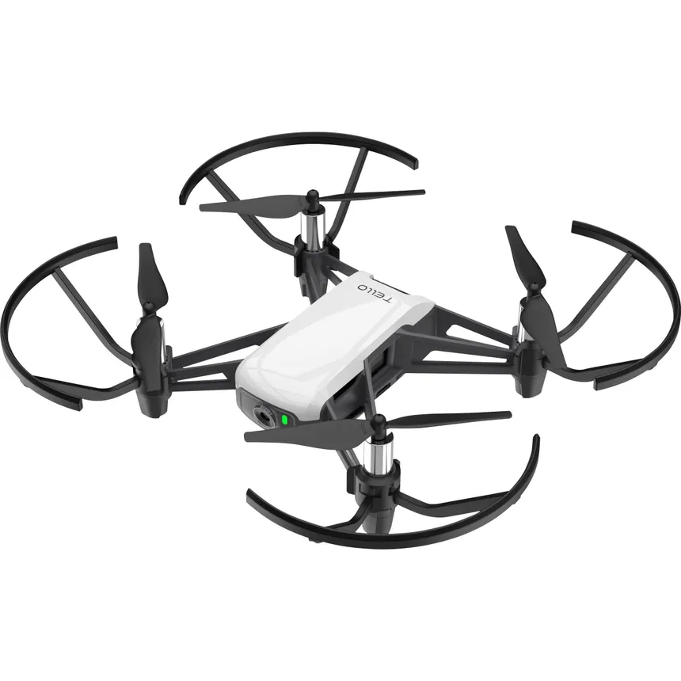

# Tello Drone Control Project



Welcome to the Tello Drone Control Project! This repository contains the source code and documentation for controlling a Tello drone using Python and various libraries. Whether you're looking to explore drone programming or use the Tello drone for fun or educational purposes, this project provides a platform to get started.

## Features

- Real-time video streaming from Tello drone to your computer.
- Keyboard control to navigate the drone.
- Gesture-based control using hand tracking.
- Face detection on the drone's camera feed.
- Video recording and saving directly from the drone's camera.

## Prerequisites

Before you start using the Tello Drone Control Project, make sure you have the following:

- A Tello drone.
- Python 3.x installed on your computer.
- Required Python libraries installed (list in the documentation).
- A compatible computer with Wi-Fi for drone communication.

## Getting Started

1. Clone this repository to your local machine:

   ```bash
   git clone https://github.com/your-username/tello-drone-project.git

2. Install these dependencies from the REQUIREMENTS.txt file:

    ```bash
    pip install -r REQUIREMENTS.txt

3. Run the project by executing the main.py script:
    ```bash
    python main.py

## Acknowledgements

Thank you to the author of the inspiring code used in this project, which is based on the DJITelloPy library's manual control example. The original source code can be found here: [DJITelloPy Manual Control Example](https://github.com/damiafuentes/DJITelloPy/blob/master/examples/manual-control-pygame.py).

---

Feel free to contribute to this project or report any issues. For questions or support, please open an issue on this repository.

Happy flying! 🚁
